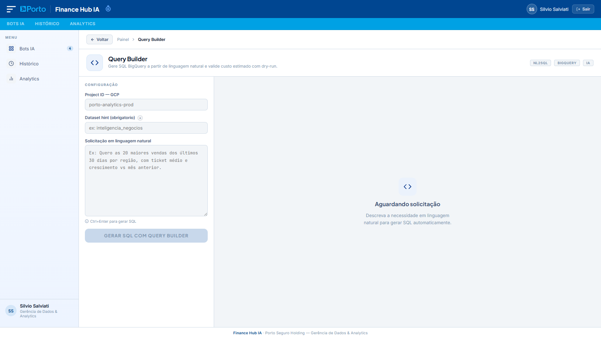
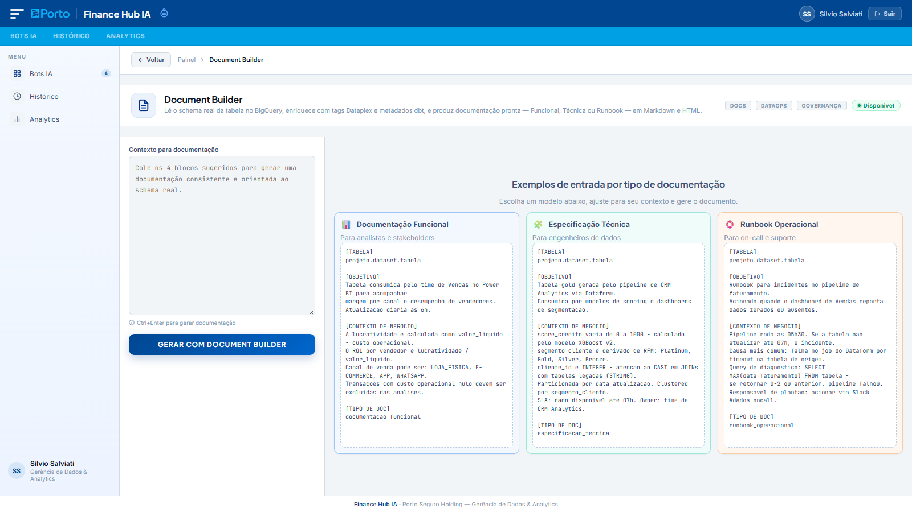

# Finance Hub

Plataforma de assistentes de dados com backend FastAPI, frontend web e fluxos baseados em LangGraph para BigQuery.

## Visão Geral

O projeto centraliza assistentes especializados para analytics, documentação e geração de SQL:

- Query Analyzer: analisa SQL existente, detecta antipadrões e sugere otimizações.
- Query Builder: gera SQL a partir de linguagem natural com contexto real de dataset.
- Document Builder: gera documentação técnica, funcional e operacional com base em artefatos reais do BigQuery e do Dataplex Catalog.
- Finance Auditor: pacote reservado para evolução futura.

Na interface, os nomes visíveis já foram atualizados para Query Builder e Document Builder. Internamente, os `agent_id` continuam `query_build` e `document_build` para manter compatibilidade com a API.

## Arquitetura Atual

```text
bot-query/
├── src/
│   ├── api/
│   │   ├── main.py                  # app FastAPI, CORS, startup e arquivos estáticos
│   │   ├── dependencies.py          # sessão, auth, registry de agentes e checkpointer
│   │   └── routes/
│   │       ├── auth.py              # login, logout e /me
│   │       └── agents.py            # endpoints dos agentes e runtime LLM
│   ├── agents/
│   │   ├── query_analyzer/          # agente implementado
│   │   ├── query_build/             # agente implementado
│   │   ├── document_build/          # agente implementado
│   │   └── finance_auditor/         # placeholder de pacote/grafo
│   ├── core/
│   │   ├── base_agent.py            # contrato base dos agentes
│   │   ├── registry.py              # registro e resolução de agentes
│   │   └── checkpointer.py          # checkpoint em arquivo com TTL
│   └── shared/
│       ├── config.py                # leitura e validação das variáveis de ambiente
│       ├── tools/
│       │   ├── llm.py               # criação da LLM conforme provider
│       │   ├── bigquery.py          # validações, schema, amostras e dry-run
│       │   └── schemas.py
│       └── utils/
├── docs/                            # materiais complementares
├── scripts/publish.ps1              # fluxo local de teste + commit + push
├── static/                          # frontend HTML/CSS/JS e imagens
├── tests/                           # testes automatizados
└── requirements.txt
```

Arquivos de referência:

- [src/api/main.py](src/api/main.py)
- [src/api/dependencies.py](src/api/dependencies.py)
- [src/core/base_agent.py](src/core/base_agent.py)
- [src/core/registry.py](src/core/registry.py)
- [src/core/checkpointer.py](src/core/checkpointer.py)
- [src/shared/tools/bigquery.py](src/shared/tools/bigquery.py)
- [static/index.html](static/index.html)
- [static/js/scripts.js](static/js/scripts.js)

## Agentes e Status

| Agente no produto | `agent_id`        | Status                      | Registro no runtime |
| ----------------- | ----------------- | --------------------------- | ------------------- |
| Query Analyzer    | `query_analyzer`  | Implementado                | Sim                 |
| Query Builder     | `query_build`     | Implementado                | Sim                 |
| Document Builder  | `document_build`  | Implementado                | Sim                 |
| Finance Auditor   | `finance_auditor` | Placeholder de pacote/grafo | Não                 |

Observação: atualmente o runtime registra Query Analyzer, Query Builder e Document Builder.

## Fluxo Técnico

1. O frontend envia a requisição para a API com token Bearer quando o endpoint exige autenticação.
2. As rotas validam payload, sessão e contexto de dataset ou tabelas quando aplicável.
3. O registry resolve o agente por `agent_id`.
4. O agente executa seu fluxo LangGraph.
5. As ferramentas compartilhadas consultam BigQuery, catálogo e LLM.
6. O resultado final pode ser persistido em checkpoint por sessão.

## Query Analyzer

Entrada:

- `query`
- `project_id`
- `dataset_hint` opcional

Pipeline de alto nível:

1. Parse estrutural da query.
2. Dry-run do SQL original.
3. Detecção de antipadrões.
4. Tentativa de otimização.
5. Validação da query otimizada.
6. Geração do relatório final.

Saída principal:

- score e grade de eficiência
- antipadrões e recomendações
- query otimizada
- aba de otimizações aplicadas no frontend
- bytes e custo original versus otimizado
- dicas de uso para Power BI

Validação de contexto:

- endpoint: `POST /api/agents/query_analyzer/validate-query-context`
- extrai tabelas no formato `project.dataset.tabela`
- exige apenas um dataset por análise
- valida dataset e tabelas no BigQuery
- tenta enriquecer a validação com metadados do catálogo
- libera o botão de análise somente após sucesso

## Query Builder

Entrada:

- `query` em linguagem natural
- `project_id`
- `dataset_hint` opcional, porém recomendado

Pipeline de alto nível:

1. Gera SQL com contexto de tabelas reais do dataset.
2. Revisa e otimiza a SQL gerada.
3. Executa dry-run.
4. Coleta amostra de dados.

Saída principal:

- SQL gerada
- explicação e premissas
- warnings de validação
- dry-run com bytes, custo e erro
- sample de colunas e linhas

Validação de dataset:

- endpoint: `POST /api/agents/query_build/validate-dataset`
- valida a existência do dataset no BigQuery
- retorna `valid`, `table_count` e mensagem de status
- o frontend bloqueia a geração da SQL quando o dataset não foi validado

## Document Builder

Entrada recomendada na interface:

```text
[TABELA]
projeto.dataset.nome_da_tabela

[OBJETIVO]
Para que serve essa tabela e quem a consome.

[CONTEXTO DE NEGÓCIO]
Regras, cálculos e decisões suportadas pela tabela.

[TIPO DE DOC]
especificacao_tecnica | documentacao_funcional | runbook_operacional
```

Observações da API e da interface:

- o endpoint continua recebendo `query`, `project_id` e `dataset_hint`
- na interface web, `project_id` e `dataset_hint` não são mais exibidos ao usuário
- o contexto técnico é derivado principalmente do bloco `[TABELA]`

Pipeline de alto nível:

1. Parse da solicitação e extração dos blocos estruturados.
2. Leitura do schema real no BigQuery, com colunas, tipos, particionamento e clustering.
3. Consulta ao Dataplex Catalog para buscar aspects e glossário associados à tabela.
4. Geração da estrutura documental pela LLM com base em artefatos reais.
5. Consolidação do documento final em Markdown.
6. Cálculo do `quality_score` documental.

Saída principal:

- `title`, `doc_type`, `summary`
- seções técnicas estruturadas
- checklist de aceitação e próximos passos
- `markdown_document` pronto para copiar ou publicar
- `quality_score` da documentação
- governança enriquecida com dados do Dataplex quando disponível

Recursos recentes do Document Builder:

- cards de exemplo centralizados no estado vazio
- orientação de entrada em 4 blocos
- geração de Markdown
- aba Documento HTML com preview e fonte completa para cópia
- aba Confluence com Wiki Markup pronto para colar
- botão de cópia dedicado para Markdown, HTML e Confluence
- template HTML com identidade visual executiva e logo Porto Seguro

Importante: a integração com `manifest.json` do dbt foi removida do pipeline atual. O fluxo vigente usa BigQuery + Dataplex Catalog + LLM.

## Autenticação e Sessão

- login via `POST /api/login`
- sessões em memória com TTL configurável por `SESSION_TTL_HOURS`
- acesso protegido via header `Authorization: Bearer <token>`
- logout via `POST /api/logout`

## Checkpoints

- checkpoints salvos em `.sixth/checkpoints`
- chave no formato `<token>-<agent_id>`
- TTL atual de 24h no `FileCheckpointer`
- consulta via `GET /api/agents/{agent_id}/checkpoint`

## Requisitos

- Python 3.10+
- ambiente virtual ativo
- credenciais GCP válidas para BigQuery e Dataplex Catalog
- provider de LLM suportado: `vertexai`

## Instalação

```powershell
python -m venv .venv
.\.venv\Scripts\Activate.ps1
pip install -r requirements.txt
```

## Variáveis de Ambiente

Configure o arquivo `.env` com base em [src/shared/config.py](src/shared/config.py).

Obrigatórias:

- `LLM_PROVIDER`
- `GCP_PROJECT_ID`
- `GOOGLE_APPLICATION_CREDENTIALS`

Provider Vertex AI:

- `VERTEXAI_PROJECT`
- `VERTEXAI_LOCATION`
- `VERTEXAI_MODEL`
- `VERTEXAI_MAX_OUTPUT_TOKENS`
- `VERTEXAI_MAX_RETRIES`
- `VERTEXAI_TEMPERATURE`

Sessão e limites:

- `SESSION_TTL_HOURS`
- `ALLOWED_ORIGINS` em CSV
- `BQ_COST_PER_TB_USD`
- `BYTES_WARNING_THRESHOLD`
- `BYTES_CRITICAL_THRESHOLD`

Usuários da aplicação:

- recomendado: `APP_USERS` no formato `usuario:senha_ou_hash:nome`
- fallback: `APP_USERNAME`, `APP_PASSWORD`, `APP_NAME`

Exemplo:

```env
LLM_PROVIDER=vertexai
VERTEXAI_PROJECT=meu-projeto
VERTEXAI_LOCATION=us-central1
VERTEXAI_MODEL=gemini-2.5-flash
VERTEXAI_MAX_OUTPUT_TOKENS=4096
VERTEXAI_MAX_RETRIES=1
VERTEXAI_TEMPERATURE=0.05
GCP_PROJECT_ID=meu-projeto
GOOGLE_APPLICATION_CREDENTIALS=secrets/credentials.json
APP_USERS=analista:$2b$12$hash_bcrypt_aqui:Analista de Dados
```

## Execução

```powershell
uvicorn src.api.main:app --host 0.0.0.0 --port 8000 --reload
```

Alternativa:

```powershell
python src/api/main.py
```

Portal local:

- http://localhost:8000

## Publicação no Git

Fluxo recomendado com o script do projeto:

```powershell
.\scripts\publish.ps1 -Message "feat: descrição da alteração"
```

Opcional para pular testes:

```powershell
.\scripts\publish.ps1 -Message "chore: ajuste rápido" -SkipTests
```

O script executa:

1. valida se você está na raiz de um repositório git
2. executa `pytest -q`, exceto com `-SkipTests`
3. roda `git add -A`
4. cria o commit com a mensagem informada
5. faz push para `origin/<branch-atual>`

Fluxo manual equivalente:

```powershell
pytest -q
git add -A
git commit -m "feat: descrição da alteração"
git push origin <branch-atual>
```

## Endpoints Principais

Públicos:

- `GET /`
- `GET /health`
- `GET /favicon.ico`
- `POST /api/login`
- `GET /api/runtime-llm`

Protegidos por sessão:

- `POST /api/logout`
- `GET /api/me`
- `GET /api/agents`
- `POST /api/agents/{agent_id}/analyze`
- `POST /api/agents/query_build/validate-dataset`
- `POST /api/agents/query_analyzer/validate-query-context`
- `GET /api/agents/{agent_id}/checkpoint`

## Frontend

Arquivos principais:

- [static/index.html](static/index.html)
- [static/css/style.css](static/css/style.css)
- [static/js/scripts.js](static/js/scripts.js)

Comportamentos atuais relevantes:

- login e sessão com token Bearer
- exibição da LLM ativa via `/api/runtime-llm`
- barras de progresso para Query Analyzer e Query Builder
- Query Analyzer com `Project ID` e `Dataset hint` em modo somente leitura
- validação assíncrona do contexto da query no Query Analyzer
- validação assíncrona de `dataset_hint` no Query Builder
- Document Builder com guia de uso em 4 blocos
- Document Builder sem campos visíveis de `Project ID` e `Dataset hint`
- Document Builder com schema real e Dataplex Catalog antes da etapa LLM
- Documento HTML com preview formatado e botão de cópia
- Confluence Wiki Markup com botão de cópia
- aba Otimizações aplicadas no Query Analyzer

## Guias de Evolução

- [docs/fase-4-automated-publishing-confluence-notion.md](docs/fase-4-automated-publishing-confluence-notion.md)
- [docs/fase-4-dbt-docs-schema-yml-automatico.md](docs/fase-4-dbt-docs-schema-yml-automatico.md)

## Telas do Sistema

### Login


### Portal


### Query Analyzer


### Query Builder



### Document Builder



Observação: as imagens acima refletem a interface atual e foram alinhadas com a nomenclatura Builder usada no produto.

## Testes

Executar:

```powershell
pytest -q
```

Suites atuais:

- [tests/agents/test_query_analyzer.py](tests/agents/test_query_analyzer.py)
- [tests/agents/test_query_build.py](tests/agents/test_query_build.py)
- [tests/agents/test_document_build.py](tests/agents/test_document_build.py)
- [tests/shared/test_bigquery_tools.py](tests/shared/test_bigquery_tools.py)
