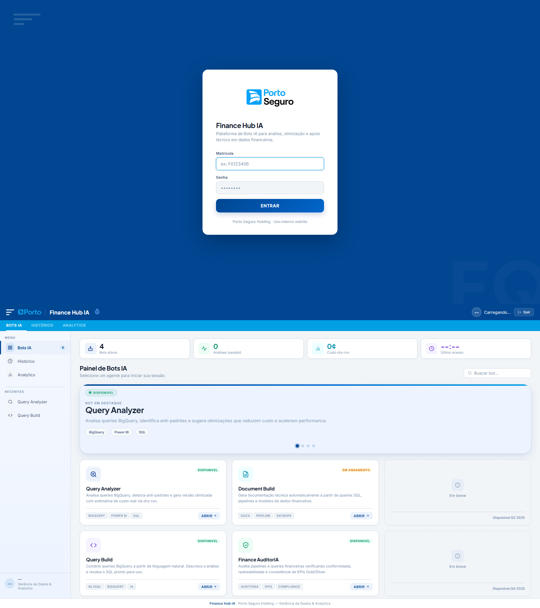
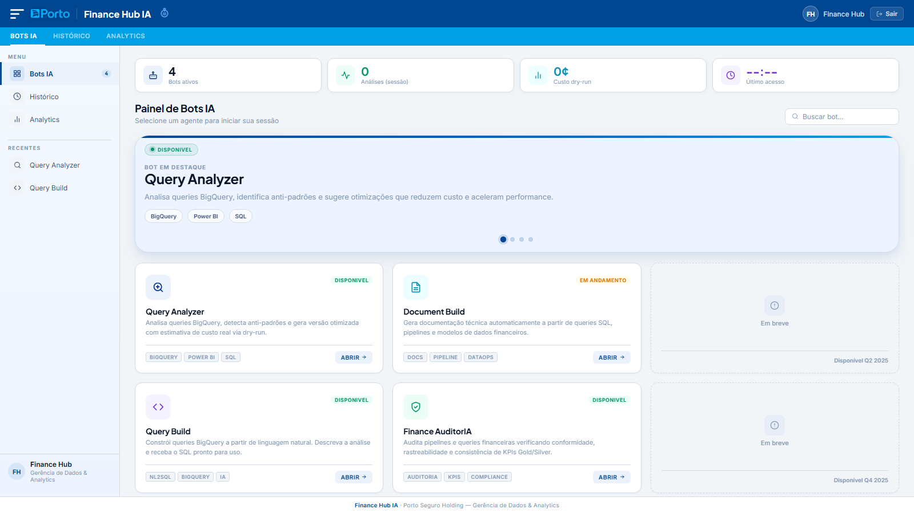
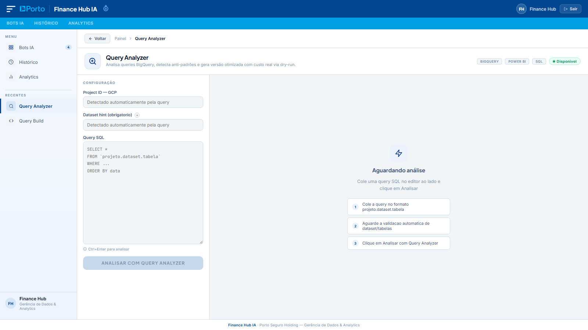
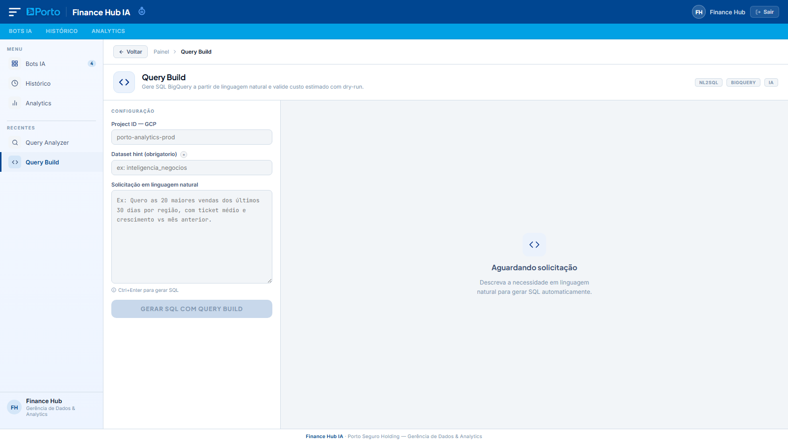

# Finance Hub

Plataforma de assistentes de dados com backend FastAPI, frontend web e fluxos baseados em LangGraph para SQL no BigQuery.

## Objetivo

Centralizar assistentes de dados para:

- analisar e otimizar queries existentes (Query Analyzer)
- construir SQL a partir de linguagem natural (Query Build)
- manter trilha de evolucao para novos agentes (Document Build e Finance Auditor)

## Arquitetura Atual

```text
bot-query/
├── src/
│   ├── api/
│   │   ├── main.py                  # app FastAPI, startup, CORS e static files
│   │   ├── dependencies.py          # sessao, auth, registry de agentes e checkpointer
│   │   └── routes/
│   │       ├── auth.py              # login, logout e /me
│   │       └── agents.py            # endpoints de agentes, runtime LLM e checkpoints
│   ├── agents/
│   │   ├── query_analyzer/          # agente implementado (LangGraph)
│   │   ├── query_build/             # agente implementado (LangGraph)
│   │   ├── document_build/          # placeholder (retorna not_implemented)
│   │   └── finance_auditor/         # placeholder de pacote/grafo
│   ├── core/
│   │   ├── base_agent.py            # contrato base de agentes
│   │   ├── registry.py              # registro e resolucao de agentes
│   │   └── checkpointer.py          # checkpoint em arquivo com TTL
│   └── shared/
│       ├── config.py                # leitura/validacao de variaveis de ambiente
│       ├── tools/
│       │   ├── llm.py               # criacao da LLM conforme provider
│       │   ├── bigquery.py          # dry-run, schema, sample e validacao de dataset
│       │   └── schemas.py
│       └── utils/
├── static/                          # portal HTML/CSS/JS
├── tests/                           # testes de agentes e utilitarios
├── scripts/publish.ps1              # fluxo local de commit + push
└── requirements.txt
```

Arquivos de referencia:

- [src/api/main.py](src/api/main.py)
- [src/api/dependencies.py](src/api/dependencies.py)
- [src/core/base_agent.py](src/core/base_agent.py)
- [src/core/registry.py](src/core/registry.py)
- [src/core/checkpointer.py](src/core/checkpointer.py)
- [src/shared/tools/bigquery.py](src/shared/tools/bigquery.py)

## Agentes e Status

| Agente          | ID                | Status                          | Registro no runtime |
| --------------- | ----------------- | ------------------------------- | ------------------- |
| Query Analyzer  | `query_analyzer`  | Implementado                    | Sim                 |
| Query Build     | `query_build`     | Implementado                    | Sim                 |
| Document Build  | `document_build`  | Placeholder (`not_implemented`) | Sim                 |
| Finance Auditor | `finance_auditor` | Placeholder de pacote/grafo     | Nao                 |

Observacao: atualmente o registry em runtime registra Query Analyzer, Query Build e Document Build.

## Fluxo Tecnico

1. Frontend envia requisicao para a API com token Bearer (quando endpoint exige autenticacao).
2. Rotas validam payload, sessao e contexto (dataset/tabelas) quando aplicavel.
3. Registry resolve o agente por `agent_id`.
4. Agente executa seu fluxo (LangGraph nos agentes implementados).
5. Ferramentas compartilhadas fazem dry-run, metadados e amostragem no BigQuery.
6. Resultado final pode ser persistido em checkpoint por sessao.

## Query Analyzer (implementado)

Entrada:

- `query`
- `project_id`
- `dataset_hint` (opcional)

Pipeline de alto nivel:

1. parse estrutural da query
2. dry-run do SQL original
3. deteccao de antipadroes
4. tentativa de otimizacao
5. validacao da query otimizada
6. geracao do relatorio final

Saida principal:

- score e grade de eficiencia
- antipadroes e recomendacoes
- query otimizada
- otimizações aplicadas (aba dedicada no frontend)
- bytes/custo original vs otimizado
- dicas de uso para Power BI

## Validacao de Contexto no Query Analyzer

Endpoint backend:

- `POST /api/agents/query_analyzer/validate-query-context`

Comportamento atual:

- extrai tabelas da query no formato `project.dataset.tabela`
- exige apenas um dataset por analise
- valida dataset no BigQuery e metadados no Data Catalog/Dataplex
- valida existencia das tabelas referenciadas
- frontend libera o botao de analise somente apos validacao com sucesso

## Query Build (implementado)

Entrada:

- `query` (pedido em linguagem natural)
- `project_id`
- `dataset_hint` (opcional, recomendado)

Pipeline de alto nivel:

1. gera SQL com contexto de tabelas reais do dataset
2. revisa/otimiza SQL gerada
3. executa dry-run
4. coleta amostra de dados

Saida principal:

- SQL gerada
- explicacao e premissas
- warnings de validacao
- dry-run (bytes/custo/erro)
- sample de colunas/linhas

## Validacao de Dataset no Query Build

Endpoint backend:

- `POST /api/agents/query_build/validate-dataset`

Comportamento atual:

- valida existencia do dataset no BigQuery
- tenta validar metadados no Data Catalog
- retorna `valid`, `table_count` e mensagem de status
- frontend bloqueia a geracao da SQL quando dataset nao foi validado

## Autenticacao e Sessao

- login via `POST /api/login`
- sessoes em memoria com TTL configuravel (`SESSION_TTL_HOURS`)
- acesso protegido via header `Authorization: Bearer <token>`
- logout via `POST /api/logout`

## Checkpoints

- checkpoints salvos em `.sixth/checkpoints`
- chave: `<token>-<agent_id>`
- TTL de checkpoint: 24h (configuracao atual do `FileCheckpointer`)
- consulta via `GET /api/agents/{agent_id}/checkpoint`

## Requisitos

- Python 3.10+
- ambiente virtual ativo
- credenciais GCP validas para BigQuery/Data Catalog
- provider de LLM suportado (`openai`, `vertexai` ou `huggingface`)

## Instalacao

```powershell
python -m venv .venv
.\.venv\Scripts\Activate.ps1
pip install -r requirements.txt
```

## Variaveis de Ambiente

Configure o arquivo `.env` com base em [src/shared/config.py](src/shared/config.py).

Obrigatorias:

- `LLM_PROVIDER`
- `GCP_PROJECT_ID`
- `GOOGLE_APPLICATION_CREDENTIALS`

Provider OpenAI:

- `OPENAI_API_KEY`
- `OPENAI_MODEL` (default atual: `gpt-4o`)

Provider Vertex AI:

- `VERTEXAI_PROJECT`
- `VERTEXAI_LOCATION`
- `VERTEXAI_MODEL`

Provider Hugging Face:

- `HF_API_TOKEN`
- `HF_MODEL_ID`
- `HF_ENDPOINT_URL` (opcional)
- `HF_MAX_NEW_TOKENS`
- `HF_TEMPERATURE`

Sessao e limites:

- `SESSION_TTL_HOURS`
- `ALLOWED_ORIGINS` (csv)
- `BQ_COST_PER_TB_USD`
- `BYTES_WARNING_THRESHOLD`
- `BYTES_CRITICAL_THRESHOLD`

Usuarios da aplicacao:

- recomendado: `APP_USERS` no formato `usuario:senha_ou_hash:nome`
- fallback: `APP_USERNAME`, `APP_PASSWORD`, `APP_NAME`

Exemplo:

```env
LLM_PROVIDER=openai
OPENAI_API_KEY=...
OPENAI_MODEL=gpt-4o
GCP_PROJECT_ID=meu-projeto
GOOGLE_APPLICATION_CREDENTIALS=secrets/credentials.json
APP_USERS=analista:$2b$12$hash_bcrypt_aqui:Analista Dados
```

## Execucao

```powershell
uvicorn src.api.main:app --host 0.0.0.0 --port 8000 --reload
```

Alternativa:

```powershell
python src/api/main.py
```

Portal local:

- http://localhost:8000

## Endpoints Principais

Publicos:

- `GET /`
- `GET /health`
- `GET /favicon.ico`
- `POST /api/login`
- `GET /api/runtime-llm`

Protegidos por sessao:

- `POST /api/logout`
- `GET /api/me`
- `GET /api/agents`
- `POST /analyze`
- `POST /api/agents/{agent_id}/analyze`
- `POST /api/agents/query_build/validate-dataset`
- `POST /api/agents/query_analyzer/validate-query-context`
- `GET /api/agents/{agent_id}/checkpoint`

## Frontend

Arquivos principais:

- [static/index.html](static/index.html)
- [static/css/style.css](static/css/style.css)
- [static/js/scripts.js](static/js/scripts.js)

## Telas do Sistema

### Login



### Portal (Bots IA)



### Query Analyzer



### Query Build



Observacao: as imagens acima sao capturas reais da interface atual para documentacao visual.

Comportamentos atuais relevantes:

- login e sessao com token Bearer
- exibicao da LLM ativa via `/api/runtime-llm`
- barras de progresso para Query Analyzer e Query Build
- Query Analyzer com `Project ID` e `Dataset hint` em modo somente leitura
- validacao assincrona do contexto da query no Query Analyzer (input + debounce)
- validacao assincrona de `dataset_hint` no Query Build (input, blur e debounce)
- aba `Otimizacoes aplicadas` no resultado do Query Analyzer

## Testes

Executar:

```powershell
pytest -q
```

Suites atuais:

- [tests/agents/test_query_analyzer.py](tests/agents/test_query_analyzer.py)
- [tests/agents/test_query_build.py](tests/agents/test_query_build.py)
- [tests/agents/test_document_build.py](tests/agents/test_document_build.py)
- [tests/shared/test_bigquery_tools.py](tests/shared/test_bigquery_tools.py)

## Script de Publicacao Local

Com testes:

```powershell
.\scripts\publish.ps1 -Message "feat: descricao da alteracao"
```

Sem testes:

```powershell
.\scripts\publish.ps1 -Message "chore: ajuste rapido" -SkipTests
```

O script executa:

1. validacao de repositorio e branch atual
2. `pytest -q` (quando `-SkipTests` nao for informado)
3. `git add -A`
4. `git commit -m "..."`
5. `git push origin <branch-atual>`
